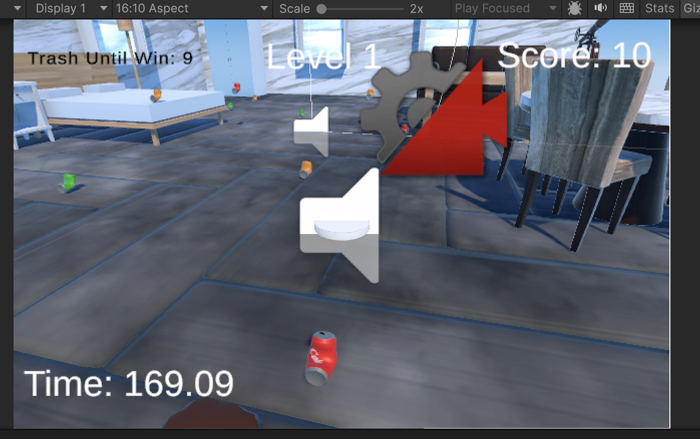
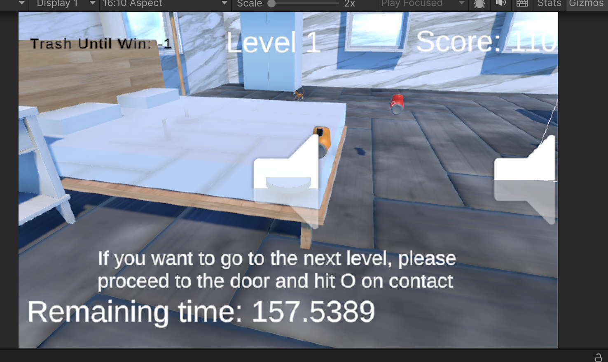
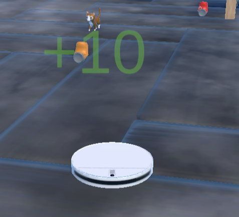

# Cleaner Robot Simulator

## Team members:
Tianyou Liu, Nian Gao, Alina Pan

## Game summary
A sweeping robot simulator game where the player controls a sweeping robot to explore rooms, cleaning up trash while avoiding obstacles.

## Genres
- Simulator  
- Third-person  
- Exploration

## Inspiration

### 1. Robo Vacuum Simulator
Robo Vacuum Simulator is one of our primary inspirations. In this game, the player controls a cleaner robot to suck up garbage in a variety of settings. We want to add more elements to our game, including changes in weather/lighting, a point system for the garbage collected, and possible "enemies" such as pets that must be avoided. Our robot would ideally be round instead of square.  
  
Source: [Steam - Robo Vacuum Simulator](https://store.steampowered.com/app/1766150/Robo_Vacuum_Simulator/)

### 2. Roombo: First Blood
This 3D action game on Steam features a cleaner robot that uses various gadgets to defend a house from invaders. After the battle, the robot cleans up the mess left behind. Our focus is on the cleaning mechanics rather than combat. We aim to include a challenge element by introducing household pets as obstacles at higher difficulty levels.  
  
Source: [Steam - Roombo: First Blood](https://store.steampowered.com/app/1004610/Roombo_First_Blood/)

### 3. Rock Simulator
Rock Simulator is a unique game where players experience life as a rock, observing different environments and weather conditions. The idea of taking on the role of an everyday object is intriguing and inspires us to deliver an immersive simulation experience.  
  
Source: [Steam - Rock Simulator](https://store.steampowered.com/app/1187510/Rock_Simulator/)

## Gameplay

- **Player Role:** Control an advanced robot vacuum cleaner in a detailed 3D home environment.
- **Objectives:**
  - **Easy Mode:**  
    - Navigate through various rooms to collect a specified amount of dust.
    - Overcome obstacles (e.g., jumping onto tables, avoiding collisions with sofas, maneuvering under furniture).
  - **Medium Mode:**  
    - In addition to dust collection, avoid interference from household pets like cats and dogs.
  - **Hard Mode:**  
    - ~~Defend the home from intruders using built-in defensive mechanisms.~~
- **Mechanics:**
  - ~~**Item Interaction:** Collect and use items (e.g., speed boosts, temporary shields).~~
  - **Time Management:** Complete tasks within set time limits to advance.
  - **Dynamic Environment:** Experience realistic day-night cycles and weather changes.
  - **Performance Based Ranking:** The player will be awarded different points based on performance measured by time and trash collected
- **Graphics & Controls:**
  - First-person perspective with low-poly, stylized graphics.
  - Intuitive controls using keyboard (WASD for movement, Space for jump) or game controller.
  - On-screen displays include a dust collection meter, battery life indicator, ~~and a mini-map.~~

## Development Plan  

### Project Checkpoint 1-2: Basic Mechanics and Scripting (Ch 5-9)

- **Tasks Completed:**
  - ~~Created prefabs for the robot, furniture, room, and trash.~~
  - ~~Implemented basic player movement using **WASD** controls.~~
  - ~~Enabled jumping to allow interaction with elevated surfaces.~~
  - ~~Implemented collision detection for trash collection.~~
  - ~~Developed basic game logic, including win and lose conditions.~~
  - ~~Created essential game scenes: **Room Scene**, **Win Scene**, and **Lose Scene**.~~

- **Deferred Tasks:**
  - **Refining Collision Detection:**  
    ~~The trash collection system works, but collision detection needs further refinement for smoother gameplay.~~
  - **UI Elements (Scoreboard & Timer):**  
    ~~Positioning issues with the UI have delayed full implementation; these will be completed in the next phase.~~

- **Additions:**
  - ~~Implemented a Game Manager script to handle win/lose conditions dynamically.~~
  - ~~Added a “bad trash” mechanic that reduces the player’s score.~~
  - ~~Introduced a jump mechanic to allow the robot to clean trash on elevated surfaces.~~

---

### Project Part 2: 3D Scenes and Models (Ch 3+4, 10)

- **Environment Design:**
  - ~~Replaced basic primitives with detailed 3D models for furniture and household objects.~~
  - ~~Future work includes importing models with realistic proportions and textures to better simulate a home setting.~~
  
- **Texture and Material Improvements:**
  - ~~Enhanced realism by applying high-quality textures and materials to floors, walls, and trash.~~
  - Future plan: Incorporate materials with improved reflectivity, bump maps, and tiling patterns.

- **Enhanced Collision System:**
  - ~~Improved physics interactions between the robot and in-game objects using Unity’s advanced physics features.~~

- **Expanding Game Logic:**
  - ~~Introduced a more structured game loop to dynamically load different levels/scenarios.~~
  - Future plan: Add more levels to increase replayability.

- **Introducing New Gameplay Elements:**
  - **Obstacle Mechanics:**  
    ~~On collision with a trash item, the robot experiences a temporary slowdown, requiring strategic movement.~~
  - **Bad Trash Mechanic:**  
   ~~ The robot is programmed to detect and avoid “bad trash” which negatively affects the score.~~

- **Additions:**
  - No additional tasks were made beyond the planned improvements.

---
### Project Part 3: Visual Effects (Ch 11, 12, 13)

- **Lighting and Shadows:**
  - Planned improvements include applying advanced lighting methods (e.g., night and day cycles) to enhance scene aesthetics. 
    - We followed the textbook and created a 6-sided skybox material, then applied it to the sky setting. However, the day-night cycle is not yet implemented and will be deferred to the next milestone.

- **Particle System and Visual Effects:**
  - ~~Planned use of particle systems to create vivid visual effects (e.g., fire and water) for elements such as fireplaces and sinks.~~  
    - We used Unity’s particle system to create a working fireplace visual effect.

- **Post Processing:**
  - ~~Planned use of post-processing tools (e.g., depth map) for enhanced visual quality.~~  
    - We applied post-processing effects such as bloom to enhance the game’s lighting and mood.

- **Additional Plans:**
  - ~~Future work will include additional levels with increased difficulty and integrated score calculations via text UI.~~  
    - We added a new Level 3 to fit with the new fireplace, garden, and water elements (see Additions below).

- **Additions:**
  - 🆕 Added Level 3, which includes new environmental elements such as a garden, fireplace, and a plane-based moving water area.
  - 🐱 Introduced a cat obstacle: a cat that occasionally jumps on top of the robot vacuum and temporarily slows its movement, increasing challenge and interactivity.

—
### Project Checkpoint 3-4: Sound, UI, and Animation (Ch 14, 15, 17)
- **Sound:**
  - ~~Plan to add background music and sound effects for collision, trash pickup, and low battery.~~  
    - ✅ Added background music to enhance immersion during gameplay.  
    - ✅ Sound effects for collision trash pickup and jump is finished

- **UI:**
  - ~~Refine scoreboard and timer layout.~~  
    - ✅ Improved scoreboard visibility and adjusted timer positioning for better readability. Added "trash remaining" to show the number of trash objects left in the current scene.
    - ✅ A new winning message is now displayed, including a rank indicator based on remaining time and score.
  - ~~Implement an animated menu screen.~~  
    - 🔄 In progress – the base menu is functional with exit (exit the game) and restart (restart current level) but further animation polish is deferred to the final milestone. We believe level selection does not fit our game logic well since each level has different difficulty, we want players not to jump levels, so we decided not to implement level selection UI. In the future we might implement a mechanism for the user to skip a level if they have already played that level, but since there is only three levels for our game that might be redundent.

- **Animation:**
  - ~~Animate trash items disappearing when collected.~~  
    - ✅ Implemented: trash items now fade out when collected.
  - ~~Add idle/wheel-turning animations for the robot.~~  
    - 🔄 Wheel-turning animation is unnecessary since we can't really see the wheel very closely and clearly. 

- **Additions:**
  - ~~⚠️ Battery indicator not implemented yet – may be added in the next milestone (unsure if necessary).~~
  - ~~🆕 Updated and swapped out prefab models to improve environmental consistency and clarity.~~
  - ~~🚪 Refined gameplay logic: players now reach a door to transition to the next level by hitting O (as commanded by the UI)~~
  - ~~🕹️ UI now includes options to exit and restart.~~
  - ~~📷 Camera animation is implemented to go over the map on the current level as the game starts.~~
  - ~~⤴️ Press ‘E’ to rotate the camera to avoid objects blocking users’ views.~~
  - ~~‼️ Implemented 'O' for next level: in order to go to the next scene, follow the instruction displayed after winning, go to the door and press 'O'~~
  - ‼️ Special note: for the ranking, there is a 5 second time window to collect beyond 10 trash (go above 100 points), this is not a bug. By doing so the player can trigger additional points and have special rankings for tasks completed in the 5 second period. Even if time ran out in this five seconds, the player still wins the game but there are not special ranks.
 

---
### Project Part 4: Finishing Touches (Ch 18, 19 + Final Polish)

- **Performance Optimization:**
  - ❌ Planned improvements include profiling the game and reducing bottlenecks to ensure smooth performance, especially in Level 3 which contains many assets and particle systems.  
    - Not implemented yet, but will be completed by the final project submission. This is more of a final step, and performance has been acceptable during playtesting due to the game's lightweight nature.

- **Menu and Scene Transitions:**
  - ~~Planned updates to main menu visuals and smoother scene transitions.~~  
    - ✅ For better user experience, we added on-screen instructions at the bottom (e.g., “Press ESC to exit the game” or “O for next level”) after players complete a level. These help users navigate more easily with the keyboard.
  - ~~Final polish on animations will be added in the last week.~~  
    - ✅ We polished the cat animations and adjusted their positions. The robot can now turn and face the correct direction as it moves, improving overall visual feedback.

- **Additions:**
  - ~~🐞 Fixed WASD movement input bug for smoother control.~~  
  - ~~💬 Added floating "+10" (green) and "-10" (red) text when picking up good or bad trash — enhances player feedback (game juice). Extra particle effect was considered for this but ultimately not added due to unsatisfactory visuals.~~  
  - ~~✅ WebGL deployment complete; game uploaded to itch.io. Game jam submission completed on April 24.~~  
  - ~~🅰️ Added end-of-level performance rank system (A/B/C) based on trash collected — adds extra juice and replay motivation.~~
  - ~~Added a short message at the beginning of Level 1 during the camera zoom-in sequence. This text explains the basic gameplay goal and bonus system to help new players understand objectives right away.~~

—--

### Project Final Submission

- **Sound:**
  - ~~We plan to add more sound effects (cat sounds, fire sounds, ambient sounds, etc.) to create a more immersive experience.~~  
    - ✅ Added cat SFX: the cat now plays a meow sound when it jumps onto the player.  
    - ✅ Added ambient rain sound for Level 3.  
    - 🔊 *Sound references:*  
      - Cat meow: [Pixabay – Cat Meow](https://pixabay.com/sound-effects/cat-meow-297927/)  
      - Rain ambient: [SoundCloud – Sayama Rain](https://soundcloud.com/naturesoundsjp/sayama-rain-1)

- **Tutorial:**
  - ~~We plan to add an introductory level before level one to teach new players how to play this game. We plan to use interactive UI elements in the introductory level.~~  
    - ⚠️ Not fully implemented. Instead, we added helpful tips and on-screen text during Level 1 and Level 2 to guide the player through key mechanics.
    
- **Additions:**
  - ✅ Added a pause at the start of each level so that the camera can pan across the scene before gameplay begins. During this time, the timer does not count down and the player cannot move, giving players a chance to observe the layout.
  - ✅ Changed the color of some in-game text for better readability and aesthetic consistency (e.g., instructions, scores).

---

## Development

### Project Checkpoint 1-2: Basic Mechanics and Scripting

- **Implemented Elements:**
  - Created prefabs for key game objects (robot, furniture, trash).
  - Developed scripts for player movement and interactions.
  - Built basic scenes with win/lose conditions.
  - Implemented collision detection and trash collection.
  - Added a countdown timer UI (partial implementation).
  
- **Screen Captures:**
  - **Lose Scene:**  
    
  - **Win Scene:**  
    
  - **Room Scene:**  
    

- **Additions:**
  - Added a countdown timer UI (partial implementation).

---

### Project Part 2: 3D Scenes and Models

- **Added Assets:**
  - **Player Object (Cleaner Robot):**  
    Source: [Xiaomi Robot Mop - Automatic Vacuum Cleaner](https://sketchfab.com/3d-models/xiaomi-robot-mop-automatic-vacuum-cleaner-01c808d0ab9f44e184ef3005cf0fe82d)
  - **Room and Furniture:**
    - **Apartment Kit:**  
      Source: [Apartment Kit on Unity Asset Store](https://assetstore.unity.com/packages/3d/environments/apartment-kit-124055)
    - **Vintage Retro Room Props:**  
      Source: [Vintage Retro Room Props](https://assetstore.unity.com/packages/3d/props/furniture/vintage-retro-room-props-built-in-pipeline-290031)
    - **Custom Models:**  
      Bed, Lamp, and Tables (created in-house).

- **Visual Enhancements:**
  - Updated textures and materials for floors, walls, and other surfaces.
  - Refined lighting using point and directional lights to enhance the interior ambiance.
  
- **Screen Captures:**
  - **Level 1:**  
    
  - **Level 2:**  
    

- **Additions:**
  - No additional tasks were made beyond the above implementations.

---

### Project Part 3: Visual Effects

- **Implemented Elements:**
  - A new scene, level three is added to the game. The new scene is a small garden with a fireplace. The time limit is the same as the scene, but the number of trash (bad and good) as well as barriers have increased. 
 

  - The new scene now has lighting, which is the sunlight coming from the direction of the sun in the sky box.
     

  - The particle effects involve the addition of a fireplace and smoke rising from the fire. The fireplace allow the robot to pass through. The fire doesn't have functionality yet

  - A visual effect of raining was added similar to the text book, some parameters are changed to make the effect look better.

- **Asset Sources:**
 - Free Chibi Cat: https://assetstore.unity.com/packages/3d/characters/animals/mammals/free-chibi-cat-165490
- AllSky Free:
https://assetstore.unity.com/packages/2d/textures-materials/sky/allsky-free-10-sky-skybox-set-146014
- Garden:
https://assetstore.unity.com/packages/3d/props/3d-mini-garden-props-301026

- **Additions:**
  - A cat prefab is added to the game. A cat wanders around the room randomly when it doesn’t see the player. If the player comes close to it, the cat will start chasing the player and attempt to sit on the player. If the cat successfully sits on the player, the player will be slowed down for 15 seconds. After 15s, the cat gets bored and gets off the player.

---

### Project Checkpoint 3-4: Sound, UI, and Animation

- **Implemented Elements:**

  - **Sound:**
    - Background music was added to all levels to enhance the immersive feel of gameplay.
    - Trash pickup sound effect was implemented to provide auditory feedback when collecting items.
    - Sound effects for low battery and cat interactions are planned for the final milestone.

  - **UI Enhancements:**
    - The scoreboard and timer layout were refined for better visibility and consistency across levels.
    - A new animated menu allows players to start, restart, and select levels. Buttons were added for restarting levels and replaying from the game over screen.
    - Menu UI was significantly expanded to support restart, and exit features which only appears when the plyaer loses the game.

  - **Animation:**
    - We improved the jumping animation and implementation of the cat animation, added one more cat to level 2 and 3. We slowed down the cat to make the game slightly easier and to provide better player experience.
    - We implemented camera animation to have the camera going around the room to provide an overview of the map and trash at the beginning of every level.
   
- **Screen Captures:**
  - **UI Menu:**  
    
  - **Updated Scoreboard & Remaining Trash Count:**  
    
  - **Win Message:**  
    
  - **Lose Message:**  
    
  - **Directions Message:**  
    

- **Asset Sources:**
  - Trash Prefab: [Mess Maker FREE](https://assetstore.unity.com/packages/tools/modeling/mess-maker-free-213803)
  - Sound Effects (BGM): [Sidh Beag agus Sidh Mor by MUJI BGM](https://music.amazon.com/tracks/B094GJTSJK)
  - Money: [Money Pack](https://assetstore.unity.com/packages/3d/props/money-pack-84433)
  - Score & Jump & Point Deduction Sound Effect: [Score and Time](https://assetstore.unity.com/packages/audio/sound-fx/score-and-time-59255)

- **Additions:**
  - Menu UI was created to support restart, and exit features which only appears when the plyaer loses the game.
  - Background music now plays during gameplay.
  - Updated and replaced multiple prefabs to improve level visuals and object consistency.
  - Added new trash and obstacle prefabs including money, cans, and mud.
  - Refined logic to require players to reach a doorway to complete and transition levels.

---
### Project Part 4: Finishing Touches

- **Implemented Elements:**

  - **Juice & Feedback Enhancements:**
    - Added floating "+10" (green) and "-10" (red) text that appears briefly when players pick up good or bad trash. This helps reinforce feedback and adds satisfying visual feedback to every interaction.
      

    - A rank system now appears at the end of each level, grading the player's performance (A/B/C) based on how much trash was collected. This provides closure and motivation to improve.
      

  - **UI and Instructions:**
    - Added instructional messages at the bottom of the screen after level completion (e.g., “Press ESC to exit” or “Press O for next level”). These guide the player through transitions and reduce confusion.
      
    - Added a short message at the beginning of Level 1 during the camera zoom-in sequence. This text explains the basic gameplay goal and bonus system to help new players understand objectives right away.
      

  - **Animation Improvements:**
    - Polished cat positioning and animation. Cats now wander more naturally and smoothly across the level.
    - The robot now visually rotates to face the direction it’s moving, improving spatial feedback and immersion.
      

  - **Web Deployment:**
    - The game was successfully exported using WebGL and uploaded to itch.io. It was also submitted to a game jam for additional playtesting and feedback.

- **Asset Sources:**
  - N/A
- **Additions:**
  - 🐞 Fixed WASD input bug for smoother and more responsive player control.
  - 📜 Added pre and post-level instructional text for smoother user flow and camera usage.

---
### Final Project Submission

- **Implemented Elements:**

  - **Gameplay & Flow:**
    - Added a pause at the beginning of each level, during which the timer is frozen and player movement is disabled. This allows the camera to pan and gives players time to observe the layout before starting.

  - **UI & Readability:**
    - Adjusted colors of certain in-game texts (e.g., instructions, trash count, and scores) to improve clarity and contrast against different backgrounds.
      

  - **Audio & Immersion:**
    - Added cat sound effect that plays when the cat jumps onto the player, enhancing the pet interaction experience.  
      🔉 *Reference:* [Pixabay – Cat Meow](https://pixabay.com/sound-effects/cat-meow-297927/)
    - Added ambient rain sound in Level 3 to reinforce the outdoor setting and enhance mood.  
      🔉 *Reference:* [SoundCloud – Sayama Rain](https://soundcloud.com/naturesoundsjp/sayama-rain-1)

- **Additions:**

  - 🐾 Added final layer of polish to cat animations and interactions to ensure smoother blending between states.
  - 📝 Final README documentation completed, including team contributions, future work, and download instructions.

---

## Instructions for Testing the Project

- **Opening the Project:**
  - Open the Unity project in the Unity Editor.
  - In the **Project** window, navigate to the `Scenes` folder.
  - Start by opening `MainMenu.unity` to access the level selection menu.
  - Alternatively, load `level1`, `level2`, or `level3` directly to test specific scenes.

- **Gameplay Controls:**
  - **W, A, S, D:** Move the robot.
  - **Space:** Jump (to reach trash on elevated surfaces).
  - **Mouse:** Navigate menus and click UI buttons.
  - The robot automatically collects trash upon collision.
  - The player transitions to the next level by reaching the door once the target is met and pressiong 'O'

- **Core Scenes & Their Purposes:**
  - **MainMenu Scene:** Access the level selection screen and start or replay levels.
  - **Level 1–3 Scenes:** Main gameplay areas for trash collection, obstacle avoidance, and scene-based challenges.
  - ~~**Win Scene:** Displays “You Win” after collecting the required number of trash items and reaching the door.~~
  - ~~**Lose Scene:** Displays “You Lost” if the trash collection target isn’t met within the time limit.~~

- **Additional Mechanics to Test:**
  - **New Trash Types:** Includes mud, cans, and money—some may act as obstacles or "bad trash."
  - **Cat Obstacle (Level 3):** A roaming cat may jump on the robot and temporarily slow it down.
  - **New Level 3:** Features new environmental elements like the fireplace, garden, and water; increased difficulty.
  - **Menu UI:** Includes animated buttons to start/restart levels, return to main menu, and select scenes.
  - **Trash Pickup Animation & Sound:** Visual fade-out and sound effect feedback when trash is collected.

- **Additional Notes:**
  - Use the Unity Profiler if testing performance or frame drops in Level 3.
  - Cat collision and slowdown mechanics are currently set to a 15-second duration—can be tweaked in `CatBehavior.cs`.
  - UI layout may require adjustment if tested on different screen resolutions or aspect ratios.
  - The player is exptected to collect 10 trash, 100 points total. good trash (the colored cans) will award the player with 10 points each and 1 trash collcted, the bad trash (US dollars) should be avoided and if collected will give the player -10 points and -1 trash collected. The player wins by collecting 10 trash and getting 100 points (including deductions, so player might need to actually collect beyond 10 trash if they collected any bad trash). Once 100 points are met, the player will have 5 seconds to collect more trash, if they got beyond 100/130 points, they will get a special ranking. If the player's point go below 100 or time ran out during this period, the player still wins. Failing to collect 10 trash in the time limit will loose the game, and the player can select restart or quit.
 
---
### Demo

- This video showcases a full playthrough of one level, demonstrating trash collection, obstacle avoidance (e.g., cats), scoring, UI transitions, and end-game ranking.
- Here is a talked through version on google drive that you can download and view: https://drive.google.com/file/d/1Wu5C_9DG6PNdJlKik-u0cEHwTAZ-bV_u/view

---

### Download

- Here is the link to the game play: https://tianyouliusky.itch.io/cleaner-robot-simulator

---
### Future Work

In possible further development of this game, we propose implementing the following features:

- **Dynamic Lighting System:**  
  Introduce a day/night cycle that challenges players to complete levels under varying lighting conditions, enhancing gameplay complexity and immersion.

- **More Variety of Pets:**  
  Develop a more diverse range of interactive pets with different abilities that hinder the player. For example, a dog could eat trash before the player can collect it, reducing the maximum possible score in the level.

- **Interactive Environment Elements:**  
  Incorporate movable and destructible objects, potentially reducing scores when damaged or destroyed. For example, the player might accidentally knock over and break a vase on a table, resulting in a score penalty.

- **More Levels:**  
  Create more scenes with different environments for the player to play, including new in door and out door scenes. We also plan to add different trash in accordance with the scenes.  
  
---

### Member Contributions

#### Tianyou Liu

- **Prefabs:** Created and arranged the prefabs for trash. Wrote associated scripts to handle trash collection and interaction with the robot.
- **Game Manager:** Developed the GameManager script that handles level progression, restarts, and core game loop logic. Tracks collected trash and determines win conditions.
- **Level Change:** Wrote scripts for transitioning between levels via UI buttons.
- **UI:** Designed and implemented UI elements to display in-game information such as scores, remaining time, and trash count. Created the Win/Lose screens and help messages for player guidance.
- **Testing:** Conducted extensive testing on different game versions, checking core functionality and edge cases.

#### Nian Gao

- **Music and Sound Effects:** Integrated background music, ambient rain, and sound effects for player actions (jump, score gain/loss) and cat meows.
- **Player Movement:** Implemented camera rotation using E and Q keys. Refined player movement logic so that the robot model rotates based on movement direction.
- **Visual Effects:** Added floating "+10" and "-10" visual indicators to provide score feedback.
- **Occlusion Handling:** Implemented logic to make objects between the player and camera semi-transparent for better visibility.
- **Animation:** Scripted camera flyover animation at level start. Developed cat animation transitions based on behavior states (idle, walking, sitting, etc.).
- **Other:** Implemented obstacle mechanics that temporarily slow the player. Developed the cat's movement and interaction logic.

#### Alina Pan

- **Environment Assets:** Implemented later-stage environmental furniture and decor. Integrated both Unity Asset Store resources and custom-sourced textures to enhance scene realism and visual consistency.
- **Scene Loading:** Managed scene setup and loading, ensuring smooth transitions and correct placement of environmental objects across different game levels.
- **Robot Movement (Initial Prototype):** Contributed to the early development of robot movement paths and logic, laying the foundation for later refinements.
- **Map Design:** Designed and built the garden level, including layout, spatial flow, and object placement to support gameplay.
- **Documentation:** Led the creation and editing of the README and related project documentation. Organized contributions and ensured clarity and completeness in project presentation.

